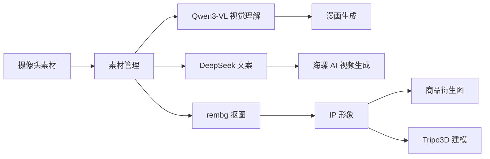

# 宠 IP 工坊 · 基于 AI 智能宠物监护摄像头的动态 IP 创作系统

将宠物监护摄像头拍摄的素材，通过 AI 技术转化为独特的 IP 内容生态，涵盖**卡通漫画生成、精华短片制作、IP 形象设计、商品衍生设计、3D 建模**等全链路创作。

---

## 功能概览

| 模块 | 说明 |
|------|------|
| **素材管理** | 上传/浏览/删除宠物监控截图素材，支持标签分类与收藏 |
| **卡通漫画生成** | 结合视觉理解模型分析素材与风格参考图，生成卡通漫画风格图像 |
| **精华短片生成** | 基于素材生成宠物生活小传文案，驱动海螺 AI 生成短视频 |
| **IP 形象设计** | 从素材中抠图去背景并卡通化，生成 IP 角色形象 |
| **IP 商品衍生** | 将 IP 形象印在马克杯、T 恤、手机壳等商品上的效果图 |
| **3D 建模** | 基于 IP 形象图生成 3D 模型，支持 glTF 导出与预览 |
| **设备管理** | 管理宠物监护摄像头设备与数据同步 |
| **仪表盘** | 素材数、漫画数、IP 数等统计数据总览 |

---

## 技术栈

### 后端

- **框架**: FastAPI (Python 3.10+)
- **AI 模型接口**:
  - ModelScope 魔搭 — FLUX 文生图、Qwen3-VL 视觉理解、SDXL 等
  - DeepSeek Chat — 文案生成（宠物人设、商品描述等）
  - HappyHorse 海螺 AI — 视频生成
  - Tripo3D — 图生 3D 模型
- **图像处理**: Pillow（压缩/滤镜/增强）、rembg（去背景）
- **数据存储**: JSON 文件持久化（`data.json`），支持图片/视频本地文件存储

### 前端

- **单页应用**（纯 HTML + CSS + JavaScript，约 320KB）
- 8 大页面：首页、设备、素材、IP 工坊、创作、定制、商城、个人
- 自适应布局，移动端友好

---

## 快速开始

### 1. 环境准备

Python 3.10+ 环境。

### 2. 克隆并安装依赖

```bash
cd pet\ 5
pip install -r requirements.txt
```

### 3. 配置环境变量

创建 `.env` 文件（已提供模板）：

```env
MODELSCOPE_API_KEY=your_api_key_here
MODELSCOPE_BASE_URL=https://api-inference.modelscope.cn/v1
```

### 4. 启动服务

```bash
python main.py
```

服务默认运行在 `http://localhost:8000`，自动打开浏览器访问前端页面。

> 也可以单独运行 `backend_smoketest.py` 测试后端 API 连通性：
> ```bash
> python backend_smoketest.py
> ```

---

## API 端点

### 系统

| 方法 | 路径 | 说明 |
|------|------|------|
| GET | `/api/health` | 健康检查 |
| GET | `/` | 前端页面 |

### 素材管理

| 方法 | 路径 | 说明 |
|------|------|------|
| POST | `/api/upload` | 上传素材图片 |
| GET | `/api/materials` | 素材列表 |
| GET | `/api/materials/{id}` | 素材详情 |
| DELETE | `/api/materials/{id}` | 删除素材 |
| POST | `/api/materials/{id}/favorite` | 收藏/取消收藏 |
| POST | `/api/materials/{id}/tags` | 更新标签 |

### IP 人设

| 方法 | 路径 | 说明 |
|------|------|------|
| GET | `/api/ip-profile` | 获取 IP 人设档案 |
| POST | `/api/ip-profile/photo` | 更新 IP 头像 |

### 创作生成

| 方法 | 路径 | 说明 |
|------|------|------|
| POST | `/api/generate/comic` | 生成卡通漫画 |
| POST | `/api/generate/story` | 生成生活小传文案 |
| POST | `/api/generate/video` | 生成精华短片 |
| POST | `/api/generate/ip` | 生成 IP 形象 |
| POST | `/api/generate/goods` | 生成商品衍生图 |
| POST | `/api/generate/3d` | 生成 3D 模型 |

### 下载

| 方法 | 路径 | 说明 |
|------|------|------|
| GET | `/api/download/comic/{file}` | 下载漫画图片 |
| GET | `/api/download/ip/{file}` | 下载 IP 形象图 |
| GET | `/api/download/goods/{file}` | 下载商品图 |
| GET | `/api/download/3d/{file}` | 下载 3D 模型 |
| GET | `/api/download/material/{file}` | 下载素材原图 |

### 设备与统计

| 方法 | 路径 | 说明 |
|------|------|------|
| GET | `/api/devices` | 设备列表 |
| POST | `/api/devices` | 添加/更新设备 |
| POST | `/api/devices/{id}/sync` | 触发设备同步 |
| GET | `/api/stats` | 统计数据 |

---

## 项目结构

```
pet 5/
├── main.py                  # FastAPI 后端主程序
├── index.html               # 前端 SPA 页面
├── data.json                # JSON 持久化数据
├── requirements.txt         # Python 依赖
├── backend_smoketest.py     # 后端冒烟测试脚本
├── .env                     # 环境变量（API Key 等）
├── static/                  # 静态资源
│   ├── materials/           # 上传的素材图片
│   ├── comic/               # 漫画预览图
│   └── ...                  # 其他静态资源
├── gen_comic/               # 生成的漫画图片
├── gen_video/               # 生成的视频文件
├── gen_ip/                  # 生成的 IP 形象图
├── gen-3d/                  # 生成的 3D 模型文件
├── upload/                  # 上传中转目录
└── Milky酱/                 # IP 品牌素材
```

---

## 创作流程



1. 上传宠物监护摄像头拍摄的素材照片
2. AI 视觉模型理解画面内容，生成宠物角色小传
3. 可选择生成漫画风格图像、短视频、IP 形象
4. IP 形象可进一步生成商品效果图或 3D 模型

---

> 本项目为 AI 创意工具演示，部分功能依赖第三方 API 服务，需自行配置有效的 API Key。
